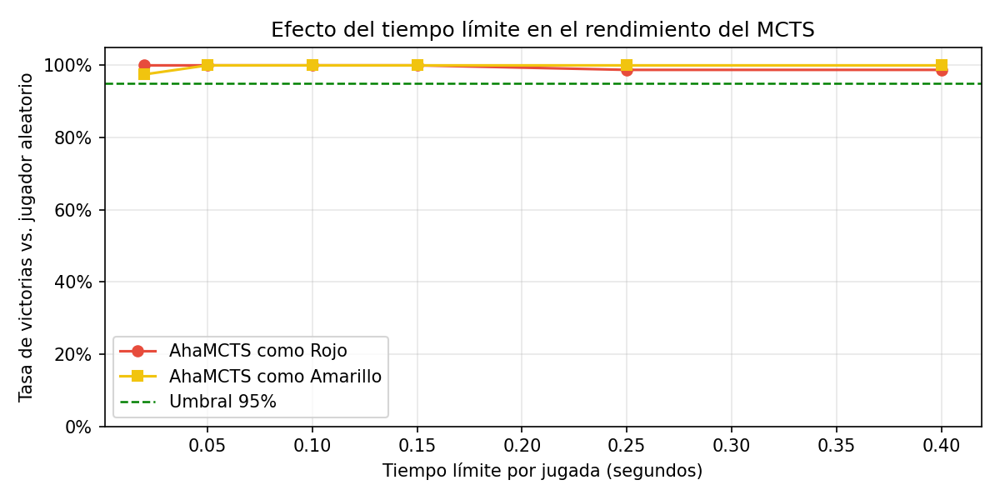
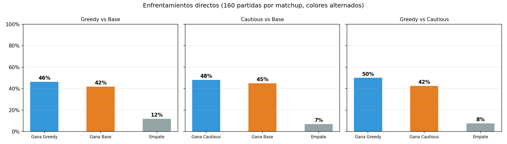

# Reto Connect-4: AhaMCTS_Greedy

**Fundamentos de Inteligencia Artificial — Universidad de La Sabana**

Este repositorio contiene la entrega individual del agente **AhaMCTS_Greedy** desarrollado para el desafío final de Connect-4. A continuación, se detallan sus principios matemáticos, el método de selección y su comparación frente a arquitecturas clásicas.

## 1. Funcionamiento del Agente: MCTS con Rollout Greedy

El agente implementa un algoritmo de **Monte Carlo Tree Search (MCTS)**. Para combatir la inmensa cantidad de estados del juego de Connect-4 (aproximadamente $4.5 \times 10^12$), el agente no intenta evaluar todo el juego de manera exacta. En su lugar, utiliza el tiempo otorgado en cada jugada (típicamente `0.15s`) para crear un árbol asimétrico "al vuelo", focalizado en las jugadas que parecen más prometedoras.

### Las 4 fases por iteración:
1. **Selección**: Baja por el árbol eligiendo los nodos que maximizan la fórmula de exploración vs explotación **UCB1** (Upper Confidence Bound 1).
2. **Expansión**: Añade un solo nuevo tablero inexplorado al final de la ruta seleccionada.
3. **Simulación (La innovación Greedy)**: A diferencia de un MCTS normal que simula moviendo aleatoriamente hasta terminar, este agente usa un *rollout greedy*. Revisa primero si hay victorias o bloqueos inmediatos. Si los hay, toma esa decisión. Si no, aplica pesos probables que favorecen las columnas centrales (1, 2, 3, 4, 3, 2, 1). Esto hace que las partidas simuladas sean mucho más representativas de un juego real.
4. **Retropropagación**: Sube de nuevo hacia la raíz actualizando los promedios de victoria.

---

## 2. Metodología de Selección

Tal como se documenta en el notebook de evaluación (`entrega.ipynb`), se probaron tres variaciones propias del MCTS:
1. **Base (Group C)**: Simulaciones 100% aleatorias, pero con reglas maestras estrictas en la raíz.
2. **Cautious (Group B)**: Añadía detección de amenazas complejas en profundidad 2.
### Análisis Gráfico

3. **Greedy (Group A)**: Modificaba el corazón matemático de la simulación aleatoria para hacerla oportunista.

### Análisis Gráfico
Al someter a los agentes frente a un jugador aleatorio, todas las versiones superaron la métrica exigida (>95% de victorias). A partir de **0.10 segundos** de tiempo límite, el agente Base ganaba de manera perfecta (ver Fig 1 en Notebook).

La decisión de seleccionar a **AhaMCTS_Greedy** se tomó a partir de torneos de enfrentamiento directo entre ellos (ver Gráficas en Notebook). Se corrieron enfrentamientos con cambio alternado de color. 
- **Greedy vs Base**: Greedy obtuvo un **46% de victorias** frente a un 42% del base.

- **Greedy vs Cautious**: Greedy dominó con un **50% de victorias** contra un 42% del cauteloso.

El agente Greedy equilibra perfectamente un tiempo de simulación rápido (para poder hacer cientos de iteraciones por segundo) con una alta calidad en la estimación de valor gracias a sus simulaciones no estúpidas.

---

## 3. Comparación con Agentes del Grupo (FVMC y ADP)

Mis compañeros de grupo abordaron el problema usando algoritmos tabulares de Aprendizaje por Refuerzo Clásico. Aquí detallo por qué MCTS demostró ser arquitectónicamente superior en este contexto competitivo.

### Frente al agente First-Visit Monte Carlo (FVMC)
El agente de FVMC requiere una fase de *pre-entrenamiento offline* (el `mount()`), en la que debe jugar millones de episodios contra sí mismo para llenar una tabla Q `(Estado, Acción) -> Utilidad`. 
* **El Problema**: El tablero de Connect-4 es demasiado grande. FVMC explora una fracción ínfima y queda "ciego" cuando en el torneo oficial el rival lo saca de los caminos pre-entrenados.
* **La Ventaja de MCTS**: Mi agente no memoriza nada antes del juego (*Online Policy Improvement*). Aprovecha sus 0.15 segundos *durante la jugada actual* para simular miles de partidas que inician exactamente en el tablero actual. Es una búsqueda adaptable y reaccionaria.

### Frente al agente Adaptive Dynamic Programming (ADP)
El algoritmo ADP intenta construir un modelo empírico de las transiciones del mundo $\hat{P}(s'|s,a)$ y calcular iterativamente el valor esperado para todas las acciones (Programación Dinámica).
* **El Problema**: Construir la matriz estocástica de Connect-4 requiere iterar sobre todos los estados posibles, haciendo que el consumo de RAM sea ridículo. Además, ADP asume que el ambiente es estacionario (que el rival actúa según una probabilidad constante).
* **La Ventaja de MCTS**: Connect-4 es determinista, y el rival cambia su estrategia (es competitivo). MCTS utiliza una aproximación similar al MiniMax probabilístico, enfocándose solo en lo que funciona en lugar de evaluar transiciones inútiles, y logrando asimetría hacia los movimientos donde hay potencial de victoria.

---
## 4. Instrucciones de Ejecución
Para evaluar este agente en el framework:
```python
from policy import AhaMCTS_Greedy

mi_agente = AhaMCTS_Greedy()
mi_agente.mount(timeout=1.0) # Configuración inicial
# Para pedirle una jugada:
columna_elegida = mi_agente.act(tablero_actual)
```
